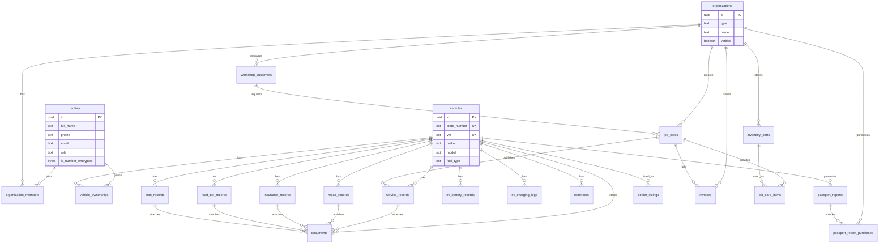

# DATABASE.md
## Vehicle Passport Malaysia (VPM)

**Version:** 1.0  
**Based on:** PRD v1.0 and UI Wireframe v1.0  
**Database:** Supabase PostgreSQL

---

## 1. Database Principles

- Use `auth.users.id` as the identity source and store product profile data in `public.profiles`.
- Keep vehicle history append-only where possible. Sensitive records are disputed, superseded, or revoked rather than hard deleted.
- Separate ownership/access from vehicle identity so ownership transfers preserve history.
- Treat workshop, dealer, insurer, and admin access as organization-scoped access.
- Store files in Supabase Storage and keep metadata in `documents`.
- Use Row Level Security on every application table.
- Use `jsonb` only for flexible snapshots, checklist fields, external payloads, or report data that is intentionally frozen.

---

## 2. ERD



---

## 3. Tables

### 3.1 Identity & Access

| Table | Purpose |
|---|---|
| `profiles` | One row per Supabase authenticated user. Stores app profile, encrypted IC, role, preferences. |
| `organizations` | Workshop, dealer, insurer, or platform partner entity. |
| `organization_members` | Maps users to organizations with organization-level roles. |
| `plans` | Subscription plan catalog for Owner Basic, Owner Plus, Workshop Starter, Workshop Pro, Dealer, Insurance Enterprise. |
| `subscriptions` | Active user or organization subscription state and report credits. |

### 3.2 Vehicle Passport Core

| Table | Purpose |
|---|---|
| `vehicles` | Canonical vehicle identity by plate/VIN with make, model, fuel type, and registration facts. |
| `vehicle_ownerships` | Historical and current owners. Supports owner, co-owner, watcher, transfer history. |
| `service_records` | Routine maintenance records, owner-declared or workshop-verified. |
| `repair_records` | Non-routine repairs, accident, flood, bodywork, mechanical, electrical records. |
| `insurance_records` | Motor insurance policy history, NCD, claims linkage, renewal preferences. |
| `road_tax_records` | Road tax renewals, expiry, amount, receipt metadata. |
| `loan_records` | Hire purchase/loan state, balance, status, settlement letter verification. |
| `ev_battery_records` | EV/PHEV battery health measurements and warranty state. |
| `ev_charging_logs` | EV/PHEV charging sessions. |
| `documents` | Document vault metadata and Supabase Storage object references. |
| `reminders` | Road tax, insurance, service, loan, campaign, and custom reminders. |

### 3.3 Reports & Monetisation

| Table | Purpose |
|---|---|
| `passport_reports` | Generated reports with frozen `data_snapshot`, confidence score, and share expiry. |
| `passport_report_purchases` | Dealer/public report purchases, credit usage, and payment reference. |
| `dealer_listings` | VPM verified listing badge records linked to reports. |

### 3.4 Workshop CRM

| Table | Purpose |
|---|---|
| `workshop_customers` | Workshop-owned customer CRM records. |
| `job_cards` | Workshop job workflow: intake, in progress, QC, awaiting parts, completed, invoiced. |
| `job_card_items` | Labour, service, parts, sundries lines attached to job cards. |
| `inventory_parts` | Workshop parts stock and reorder levels. |
| `invoices` | Workshop invoice header, payment status, totals, PDF metadata. |
| `notification_events` | SMS, WhatsApp, and email delivery log for reminders and transactional messages. |

### 3.5 Audit & Integrations

| Table | Purpose |
|---|---|
| `audit_log` | Immutable app-level audit trail for sensitive changes. |
| `integration_events` | JPJ, MyEG, insurer, bank, Puspakom, payment, and messaging integration payload tracking. |

---

## 4. Relationships

- A `profile` can own many `vehicles` through `vehicle_ownerships`.
- A `vehicle` can have only one current primary owner where `vehicle_ownerships.end_date is null and role = 'primary_owner'`.
- A `vehicle` has many service, repair, insurance, road tax, loan, EV, document, reminder, and report records.
- A `service_record` may be created by an owner or published from a `job_card`.
- A `job_card` belongs to one workshop organization, one vehicle, and optionally one workshop customer.
- A `job_card` can create one verified `service_record` after completion.
- A `repair_record` can reference an `insurance_record` when it comes from a claim.
- A `document` can attach to a vehicle generally, or to a specific record using `entity_type` and `entity_id`.
- A `passport_report` belongs to one vehicle and one generator, and may be unlocked by a purchase.
- A `dealer_listing` uses a valid `passport_report` to show a VPM Verified badge.
- Organization-scoped users access workshop/dealer/insurer records through `organization_members`.

---

## 5. Indexes

### Core Lookup Indexes

```sql
create unique index vehicles_plate_number_uidx on public.vehicles (upper(plate_number));
create unique index vehicles_vin_uidx on public.vehicles (upper(vin)) where vin is not null;
create index vehicles_make_model_idx on public.vehicles (make, model);
create index vehicles_fuel_type_idx on public.vehicles (fuel_type);
```

### Ownership & Access Indexes

```sql
create index vehicle_ownerships_vehicle_idx on public.vehicle_ownerships (vehicle_id);
create index vehicle_ownerships_owner_idx on public.vehicle_ownerships (owner_id);
create unique index vehicle_current_primary_owner_uidx
  on public.vehicle_ownerships (vehicle_id)
  where end_date is null and role = 'primary_owner';

create index organization_members_user_idx on public.organization_members (user_id);
create index organization_members_org_idx on public.organization_members (organization_id);
create unique index organization_members_user_org_uidx
  on public.organization_members (user_id, organization_id);
```

### Timeline & Dashboard Indexes

```sql
create index service_records_vehicle_date_idx on public.service_records (vehicle_id, service_date desc);
create index service_records_workshop_date_idx on public.service_records (workshop_id, service_date desc);
create index repair_records_vehicle_date_idx on public.repair_records (vehicle_id, repair_date desc);
create index insurance_records_vehicle_coverage_idx on public.insurance_records (vehicle_id, coverage_end desc);
create index road_tax_records_vehicle_expiry_idx on public.road_tax_records (vehicle_id, expiry_date desc);
create index loan_records_vehicle_status_idx on public.loan_records (vehicle_id, status);
create index ev_battery_records_vehicle_date_idx on public.ev_battery_records (vehicle_id, recorded_date desc);
create index documents_vehicle_idx on public.documents (vehicle_id, uploaded_at desc);
create index reminders_due_idx on public.reminders (due_at, status);
```

### Workshop Indexes

```sql
create index workshop_customers_org_idx on public.workshop_customers (organization_id, full_name);
create index workshop_customers_phone_idx on public.workshop_customers (phone);
create index job_cards_org_status_idx on public.job_cards (organization_id, status, created_at desc);
create index job_cards_vehicle_idx on public.job_cards (vehicle_id, created_at desc);
create index inventory_parts_org_sku_idx on public.inventory_parts (organization_id, sku);
create index invoices_org_status_idx on public.invoices (organization_id, payment_status, issued_at desc);
```

### Reports & Audit Indexes

```sql
create index passport_reports_vehicle_idx on public.passport_reports (vehicle_id, generated_at desc);
create index passport_reports_public_idx on public.passport_reports (public_token) where public_token is not null;
create index passport_report_purchases_buyer_idx on public.passport_report_purchases (buyer_id, purchased_at desc);
create index audit_log_actor_idx on public.audit_log (actor_id, created_at desc);
create index integration_events_provider_idx on public.integration_events (provider, created_at desc);
```

---

## 6. Row Level Security

### 6.1 Access Model

| Actor | Access |
|---|---|
| Vehicle owner/co-owner | Can read vehicle and related records for vehicles they currently own or watch. Can create owner-declared records. |
| Previous owner | Can read their own ownership period metadata, but not current private documents unless explicitly shared. |
| Workshop member | Can read/write workshop CRM, job cards, invoices, and verified records for their organization. Can read limited vehicle summary during lookup. |
| Dealer member | Can purchase/generate reports and read purchased report snapshots, not raw private owner data. |
| Insurer member | Can read risk/profile records only for vehicles with consent, purchased report access, or portfolio linkage. |
| Admin | Can manage users, organizations, verification, integrations, and audit review. |
| Public/anonymous | Can read valid shared report snapshots only, never raw source records. |

### 6.2 Helper Functions

```sql
create or replace function public.is_admin()
returns boolean
language sql
stable
security definer
set search_path = public
as $$
  select exists (
    select 1 from public.profiles
    where id = auth.uid()
      and role = 'admin'
  );
$$;

create or replace function public.is_vehicle_member(p_vehicle_id uuid)
returns boolean
language sql
stable
security definer
set search_path = public
as $$
  select exists (
    select 1
    from public.vehicle_ownerships vo
    where vo.vehicle_id = p_vehicle_id
      and vo.owner_id = auth.uid()
      and vo.end_date is null
      and vo.role in ('primary_owner', 'co_owner', 'watcher')
  );
$$;

create or replace function public.is_org_member(p_org_id uuid)
returns boolean
language sql
stable
security definer
set search_path = public
as $$
  select exists (
    select 1
    from public.organization_members om
    where om.organization_id = p_org_id
      and om.user_id = auth.uid()
      and om.status = 'active'
  );
$$;

create or replace function public.can_read_vehicle(p_vehicle_id uuid)
returns boolean
language sql
stable
security definer
set search_path = public
as $$
  select public.is_admin() or public.is_vehicle_member(p_vehicle_id);
$$;
```

### 6.3 Policy Pattern

```sql
alter table public.vehicles enable row level security;
alter table public.vehicle_ownerships enable row level security;
alter table public.service_records enable row level security;
alter table public.repair_records enable row level security;
alter table public.insurance_records enable row level security;
alter table public.road_tax_records enable row level security;
alter table public.loan_records enable row level security;
alter table public.ev_battery_records enable row level security;
alter table public.ev_charging_logs enable row level security;
alter table public.documents enable row level security;
alter table public.reminders enable row level security;
alter table public.organizations enable row level security;
alter table public.organization_members enable row level security;
alter table public.workshop_customers enable row level security;
alter table public.job_cards enable row level security;
alter table public.job_card_items enable row level security;
alter table public.inventory_parts enable row level security;
alter table public.invoices enable row level security;
alter table public.passport_reports enable row level security;
alter table public.passport_report_purchases enable row level security;
```

### 6.4 Representative Policies

```sql
create policy "profiles read own or admin"
on public.profiles for select
using (id = auth.uid() or public.is_admin());

create policy "profiles update own"
on public.profiles for update
using (id = auth.uid())
with check (id = auth.uid());

create policy "vehicles read by owner or admin"
on public.vehicles for select
using (public.can_read_vehicle(id));

create policy "vehicles insert authenticated"
on public.vehicles for insert
with check (auth.uid() is not null);

create policy "ownership read vehicle member"
on public.vehicle_ownerships for select
using (public.can_read_vehicle(vehicle_id) or owner_id = auth.uid());

create policy "ownership insert own vehicle claim"
on public.vehicle_ownerships for insert
with check (owner_id = auth.uid() or public.is_admin());

create policy "service read vehicle member"
on public.service_records for select
using (
  public.can_read_vehicle(vehicle_id)
  or (workshop_id is not null and public.is_org_member(workshop_id))
);

create policy "service insert owner declared"
on public.service_records for insert
with check (
  public.is_vehicle_member(vehicle_id)
  and source = 'owner_declared'
);

create policy "service insert workshop verified"
on public.service_records for insert
with check (
  workshop_id is not null
  and public.is_org_member(workshop_id)
  and source = 'workshop_logged'
);

create policy "documents read attached vehicle"
on public.documents for select
using (
  public.can_read_vehicle(vehicle_id)
  or (organization_id is not null and public.is_org_member(organization_id))
  or public.is_admin()
);

create policy "documents insert owner or org"
on public.documents for insert
with check (
  public.is_vehicle_member(vehicle_id)
  or (organization_id is not null and public.is_org_member(organization_id))
);

create policy "organizations read own org or verified public"
on public.organizations for select
using (verified = true or public.is_org_member(id) or public.is_admin());

create policy "org members read same org"
on public.organization_members for select
using (public.is_org_member(organization_id) or user_id = auth.uid() or public.is_admin());

create policy "workshop customers org members"
on public.workshop_customers for all
using (public.is_org_member(organization_id) or public.is_admin())
with check (public.is_org_member(organization_id) or public.is_admin());

create policy "job cards org members"
on public.job_cards for all
using (public.is_org_member(organization_id) or public.is_admin())
with check (public.is_org_member(organization_id) or public.is_admin());

create policy "reports owner generator purchaser or public token"
on public.passport_reports for select
using (
  public.can_read_vehicle(vehicle_id)
  or generated_by = auth.uid()
  or public.is_admin()
  or (public_token is not null and share_expires_at > now())
);
```

---

## 7. Supabase Schema

> This is a production-oriented starting migration. Review enum values and payment/provider fields before launch.

```sql
create extension if not exists "pgcrypto";
create extension if not exists "uuid-ossp";

create type public.app_role as enum ('owner', 'workshop', 'dealer', 'insurer', 'admin');
create type public.org_type as enum ('workshop', 'dealer', 'insurer', 'partner', 'platform');
create type public.org_member_role as enum ('owner', 'manager', 'staff', 'mechanic', 'agent', 'analyst');
create type public.member_status as enum ('invited', 'active', 'suspended');
create type public.fuel_type as enum ('petrol', 'diesel', 'mild_hybrid', 'full_hybrid', 'phev', 'bev', 'hydrogen');
create type public.transmission_type as enum ('manual', 'automatic', 'cvt', 'dct', 'single_speed', 'other');
create type public.vehicle_owner_role as enum ('primary_owner', 'co_owner', 'watcher');
create type public.record_source as enum ('owner_declared', 'workshop_logged', 'imported', 'partner_api');
create type public.verification_status as enum ('unverified', 'verified', 'disputed', 'revoked');
create type public.service_type as enum ('full_service', 'minor_service', 'oil_change', 'tyre_rotation', 'inspection', 'repair_followup', 'other');
create type public.repair_type as enum ('mechanical', 'bodywork', 'electrical', 'accident', 'flood', 'modification', 'other');
create type public.policy_type as enum ('comprehensive', 'third_party_fire_theft', 'third_party');
create type public.loan_status as enum ('active', 'settled', 'restructured', 'unknown');
create type public.charger_type as enum ('dc_fast', 'ac_level_2', 'home_ac', 'other');
create type public.document_type as enum (
  'vehicle_grant', 'road_tax_disc', 'insurance_certificate', 'puspakom_report',
  'purchase_invoice', 'loan_agreement', 'settlement_letter', 'modification_approval',
  'warranty_card', 'service_invoice', 'job_card', 'photo', 'other'
);
create type public.reminder_type as enum ('road_tax', 'insurance', 'service_due', 'loan', 'campaign', 'custom');
create type public.reminder_status as enum ('scheduled', 'sent', 'dismissed', 'completed', 'failed');
create type public.job_status as enum ('intake', 'in_progress', 'qc', 'awaiting_parts', 'completed', 'invoiced', 'cancelled');
create type public.invoice_status as enum ('draft', 'issued', 'void');
create type public.payment_status as enum ('pending', 'partial', 'paid', 'refunded', 'failed');
create type public.report_type as enum ('owner', 'purchased', 'shared', 'dealer_bulk', 'insurer');
create type public.subscription_status as enum ('trialing', 'active', 'past_due', 'cancelled', 'expired');

create table public.profiles (
  id uuid primary key references auth.users(id) on delete cascade,
  full_name text not null,
  phone text unique,
  email text,
  role public.app_role not null default 'owner',
  ic_number_encrypted bytea,
  locale text not null default 'en-MY',
  reminder_preferences jsonb not null default '{"sms": true, "whatsapp": true, "email": false}'::jsonb,
  pdpa_consented_at timestamptz,
  created_at timestamptz not null default now(),
  updated_at timestamptz not null default now()
);

create table public.organizations (
  id uuid primary key default gen_random_uuid(),
  type public.org_type not null,
  name text not null,
  ssm_number text,
  address_line1 text,
  address_line2 text,
  city text,
  postcode text,
  state text,
  contact_phone text,
  contact_email text,
  verified boolean not null default false,
  verified_at timestamptz,
  metadata jsonb not null default '{}'::jsonb,
  created_at timestamptz not null default now(),
  updated_at timestamptz not null default now()
);

create table public.organization_members (
  id uuid primary key default gen_random_uuid(),
  organization_id uuid not null references public.organizations(id) on delete cascade,
  user_id uuid not null references public.profiles(id) on delete cascade,
  role public.org_member_role not null,
  status public.member_status not null default 'active',
  created_at timestamptz not null default now()
);

create table public.plans (
  id uuid primary key default gen_random_uuid(),
  code text not null unique,
  name text not null,
  audience public.org_type,
  monthly_price_rm numeric(10,2),
  annual_price_rm numeric(10,2),
  report_credits_per_month int not null default 0,
  limits jsonb not null default '{}'::jsonb,
  active boolean not null default true
);

create table public.subscriptions (
  id uuid primary key default gen_random_uuid(),
  plan_id uuid not null references public.plans(id),
  user_id uuid references public.profiles(id) on delete cascade,
  organization_id uuid references public.organizations(id) on delete cascade,
  status public.subscription_status not null,
  report_credits_remaining int not null default 0,
  current_period_start timestamptz,
  current_period_end timestamptz,
  payment_provider text,
  payment_customer_ref text,
  created_at timestamptz not null default now(),
  check ((user_id is not null) <> (organization_id is not null))
);

create table public.vehicles (
  id uuid primary key default gen_random_uuid(),
  plate_number text not null,
  vin text,
  make text not null,
  model text not null,
  variant text,
  manufacture_year int check (manufacture_year between 1900 and 2100),
  fuel_type public.fuel_type not null,
  colour text,
  transmission public.transmission_type,
  engine_cc int,
  motor_kw numeric(8,2),
  seating_capacity int,
  jpj_registration_date date,
  odometer_at_registration int,
  confidence_score int not null default 0 check (confidence_score between 0 and 100),
  created_by uuid references public.profiles(id),
  created_at timestamptz not null default now(),
  updated_at timestamptz not null default now()
);

create table public.vehicle_ownerships (
  id uuid primary key default gen_random_uuid(),
  vehicle_id uuid not null references public.vehicles(id) on delete cascade,
  owner_id uuid not null references public.profiles(id) on delete cascade,
  role public.vehicle_owner_role not null default 'primary_owner',
  start_date date not null default current_date,
  end_date date,
  transfer_type text,
  source public.record_source not null default 'owner_declared',
  created_at timestamptz not null default now(),
  check (end_date is null or end_date >= start_date)
);

create table public.service_records (
  id uuid primary key default gen_random_uuid(),
  vehicle_id uuid not null references public.vehicles(id) on delete cascade,
  workshop_id uuid references public.organizations(id),
  job_card_id uuid,
  service_date date not null,
  odometer int,
  service_type public.service_type not null,
  items_serviced jsonb not null default '[]'::jsonb,
  parts_replaced jsonb not null default '[]'::jsonb,
  labour_cost_rm numeric(12,2) not null default 0,
  parts_cost_rm numeric(12,2) not null default 0,
  total_cost_rm numeric(12,2) not null default 0,
  technician_name text,
  next_service_due_date date,
  next_service_due_odometer int,
  source public.record_source not null,
  verification_status public.verification_status not null default 'unverified',
  created_by uuid references public.profiles(id),
  disputed_at timestamptz,
  dispute_reason text,
  created_at timestamptz not null default now(),
  updated_at timestamptz not null default now()
);

create table public.repair_records (
  id uuid primary key default gen_random_uuid(),
  vehicle_id uuid not null references public.vehicles(id) on delete cascade,
  workshop_id uuid references public.organizations(id),
  insurance_record_id uuid,
  repair_date date not null,
  repair_type public.repair_type not null,
  description text not null,
  parts_replaced jsonb not null default '[]'::jsonb,
  insurance_claim_ref text,
  claim_amount_rm numeric(12,2),
  repair_cost_rm numeric(12,2),
  certifying_body text,
  verification_status public.verification_status not null default 'unverified',
  source public.record_source not null default 'owner_declared',
  created_by uuid references public.profiles(id),
  created_at timestamptz not null default now()
);

create table public.insurance_records (
  id uuid primary key default gen_random_uuid(),
  vehicle_id uuid not null references public.vehicles(id) on delete cascade,
  insurer_name text not null,
  policy_number text not null,
  policy_type public.policy_type not null,
  coverage_start date not null,
  coverage_end date not null,
  sum_insured_rm numeric(12,2),
  premium_rm numeric(12,2),
  ncd_pct numeric(5,2),
  ncd_entitlement_number text,
  named_drivers jsonb not null default '[]'::jsonb,
  endorsements jsonb not null default '[]'::jsonb,
  agent_name text,
  agent_contact text,
  renewal_reminder_enabled boolean not null default true,
  source public.record_source not null default 'owner_declared',
  created_by uuid references public.profiles(id),
  created_at timestamptz not null default now(),
  check (coverage_end >= coverage_start)
);

alter table public.repair_records
  add constraint repair_records_insurance_record_fk
  foreign key (insurance_record_id) references public.insurance_records(id);

create table public.road_tax_records (
  id uuid primary key default gen_random_uuid(),
  vehicle_id uuid not null references public.vehicles(id) on delete cascade,
  renewal_date date not null,
  expiry_date date not null,
  amount_paid_rm numeric(12,2),
  renewal_channel text,
  receipt_number text,
  source public.record_source not null default 'owner_declared',
  created_by uuid references public.profiles(id),
  created_at timestamptz not null default now(),
  check (expiry_date >= renewal_date)
);

create table public.loan_records (
  id uuid primary key default gen_random_uuid(),
  vehicle_id uuid not null references public.vehicles(id) on delete cascade,
  financier_name text not null,
  loan_account_masked text,
  start_date date,
  tenure_months int,
  loan_amount_rm numeric(12,2),
  monthly_instalment_rm numeric(12,2),
  outstanding_balance_rm numeric(12,2),
  interest_rate_pct numeric(6,3),
  status public.loan_status not null default 'unknown',
  settlement_verified boolean not null default false,
  source public.record_source not null default 'owner_declared',
  created_by uuid references public.profiles(id),
  created_at timestamptz not null default now()
);

create table public.ev_battery_records (
  id uuid primary key default gen_random_uuid(),
  vehicle_id uuid not null references public.vehicles(id) on delete cascade,
  recorded_date date not null,
  soh_pct numeric(5,2) check (soh_pct between 0 and 100),
  odometer int,
  battery_capacity_kwh numeric(8,2),
  battery_chemistry text,
  warranty_expiry_date date,
  source public.record_source not null default 'owner_declared',
  created_by uuid references public.profiles(id),
  created_at timestamptz not null default now()
);

create table public.ev_charging_logs (
  id uuid primary key default gen_random_uuid(),
  vehicle_id uuid not null references public.vehicles(id) on delete cascade,
  charged_at timestamptz not null,
  charger_type public.charger_type not null,
  kwh_added numeric(8,2),
  location text,
  odometer int,
  created_by uuid references public.profiles(id),
  created_at timestamptz not null default now()
);

create table public.documents (
  id uuid primary key default gen_random_uuid(),
  vehicle_id uuid not null references public.vehicles(id) on delete cascade,
  organization_id uuid references public.organizations(id),
  uploaded_by uuid references public.profiles(id),
  document_type public.document_type not null,
  title text not null,
  storage_bucket text not null default 'vehicle-documents',
  storage_path text not null,
  mime_type text,
  file_size_bytes bigint,
  entity_type text,
  entity_id uuid,
  expires_at date,
  ocr_status text,
  ocr_data jsonb not null default '{}'::jsonb,
  created_at timestamptz not null default now(),
  uploaded_at timestamptz not null default now()
);

create table public.reminders (
  id uuid primary key default gen_random_uuid(),
  vehicle_id uuid references public.vehicles(id) on delete cascade,
  organization_id uuid references public.organizations(id) on delete cascade,
  profile_id uuid references public.profiles(id) on delete cascade,
  type public.reminder_type not null,
  title text not null,
  body text,
  due_at timestamptz not null,
  status public.reminder_status not null default 'scheduled',
  channels jsonb not null default '{"sms": false, "whatsapp": true, "email": false}'::jsonb,
  metadata jsonb not null default '{}'::jsonb,
  created_at timestamptz not null default now()
);

create table public.workshop_customers (
  id uuid primary key default gen_random_uuid(),
  organization_id uuid not null references public.organizations(id) on delete cascade,
  profile_id uuid references public.profiles(id),
  full_name text not null,
  phone text,
  email text,
  tags text[] not null default '{}',
  preferences jsonb not null default '{}'::jsonb,
  lifetime_value_rm numeric(12,2) not null default 0,
  created_at timestamptz not null default now(),
  updated_at timestamptz not null default now()
);

create table public.job_cards (
  id uuid primary key default gen_random_uuid(),
  organization_id uuid not null references public.organizations(id) on delete cascade,
  vehicle_id uuid not null references public.vehicles(id),
  customer_id uuid references public.workshop_customers(id),
  status public.job_status not null default 'intake',
  odometer int,
  complaint text,
  service_type public.service_type,
  assigned_mechanic_id uuid references public.profiles(id),
  intake_at timestamptz not null default now(),
  completed_at timestamptz,
  notes text,
  created_by uuid references public.profiles(id),
  created_at timestamptz not null default now(),
  updated_at timestamptz not null default now()
);

alter table public.service_records
  add constraint service_records_job_card_fk
  foreign key (job_card_id) references public.job_cards(id);

create table public.inventory_parts (
  id uuid primary key default gen_random_uuid(),
  organization_id uuid not null references public.organizations(id) on delete cascade,
  sku text,
  part_name text not null,
  brand text,
  part_number text,
  supplier_name text,
  quantity_on_hand int not null default 0,
  reorder_level int not null default 0,
  unit_cost_rm numeric(12,2),
  unit_price_rm numeric(12,2),
  created_at timestamptz not null default now(),
  updated_at timestamptz not null default now()
);

create table public.job_card_items (
  id uuid primary key default gen_random_uuid(),
  job_card_id uuid not null references public.job_cards(id) on delete cascade,
  inventory_part_id uuid references public.inventory_parts(id),
  item_type text not null check (item_type in ('labour', 'part', 'sundry', 'service')),
  description text not null,
  quantity numeric(10,2) not null default 1,
  unit_price_rm numeric(12,2) not null default 0,
  total_rm numeric(12,2) generated always as (quantity * unit_price_rm) stored
);

create table public.invoices (
  id uuid primary key default gen_random_uuid(),
  organization_id uuid not null references public.organizations(id) on delete cascade,
  job_card_id uuid references public.job_cards(id),
  invoice_number text not null,
  status public.invoice_status not null default 'draft',
  payment_status public.payment_status not null default 'pending',
  subtotal_rm numeric(12,2) not null default 0,
  sst_rm numeric(12,2) not null default 0,
  total_rm numeric(12,2) not null default 0,
  issued_at timestamptz,
  paid_at timestamptz,
  pdf_storage_path text,
  created_at timestamptz not null default now(),
  unique (organization_id, invoice_number)
);

create table public.passport_reports (
  id uuid primary key default gen_random_uuid(),
  vehicle_id uuid not null references public.vehicles(id) on delete cascade,
  generated_by uuid references public.profiles(id),
  report_type public.report_type not null,
  data_snapshot jsonb not null,
  confidence_score int not null check (confidence_score between 0 and 100),
  public_token text unique,
  share_expires_at timestamptz,
  generated_at timestamptz not null default now()
);

create table public.passport_report_purchases (
  id uuid primary key default gen_random_uuid(),
  passport_report_id uuid references public.passport_reports(id) on delete set null,
  vehicle_id uuid not null references public.vehicles(id),
  buyer_id uuid references public.profiles(id),
  organization_id uuid references public.organizations(id),
  amount_rm numeric(12,2),
  credits_used int not null default 0,
  payment_provider text,
  payment_reference text,
  purchased_at timestamptz not null default now()
);

create table public.dealer_listings (
  id uuid primary key default gen_random_uuid(),
  organization_id uuid not null references public.organizations(id) on delete cascade,
  vehicle_id uuid not null references public.vehicles(id),
  passport_report_id uuid references public.passport_reports(id),
  listing_url text,
  badge_status text not null default 'active',
  created_at timestamptz not null default now()
);

create table public.notification_events (
  id uuid primary key default gen_random_uuid(),
  reminder_id uuid references public.reminders(id) on delete set null,
  profile_id uuid references public.profiles(id) on delete set null,
  organization_id uuid references public.organizations(id) on delete set null,
  channel text not null check (channel in ('sms', 'whatsapp', 'email')),
  provider text,
  provider_message_id text,
  recipient text not null,
  status text not null,
  payload jsonb not null default '{}'::jsonb,
  sent_at timestamptz,
  created_at timestamptz not null default now()
);

create table public.integration_events (
  id uuid primary key default gen_random_uuid(),
  provider text not null,
  event_type text not null,
  vehicle_id uuid references public.vehicles(id),
  organization_id uuid references public.organizations(id),
  status text not null,
  request_payload jsonb not null default '{}'::jsonb,
  response_payload jsonb not null default '{}'::jsonb,
  created_at timestamptz not null default now()
);

create table public.audit_log (
  id uuid primary key default gen_random_uuid(),
  actor_id uuid references public.profiles(id),
  organization_id uuid references public.organizations(id),
  action text not null,
  entity_type text not null,
  entity_id uuid,
  before_data jsonb,
  after_data jsonb,
  ip_address inet,
  user_agent text,
  created_at timestamptz not null default now()
);
```

### Seed Plans

```sql
insert into public.plans (code, name, audience, monthly_price_rm, annual_price_rm, report_credits_per_month, limits)
values
  ('owner_basic', 'Owner Basic', null, 0, 0, 0, '{"vehicles": 1, "reports_per_year": 1}'::jsonb),
  ('owner_plus', 'Owner Plus', null, 9.90, 99.00, 999, '{"vehicles": 5, "storage_gb": 5}'::jsonb),
  ('workshop_starter', 'Workshop Starter', 'workshop', 99.00, null, 5, '{"customers": 500, "messages_per_month": 500}'::jsonb),
  ('workshop_professional', 'Workshop Professional', 'workshop', 249.00, null, 20, '{"customers": -1, "staff": 10}'::jsonb),
  ('dealer', 'Dealer', 'dealer', 399.00, null, 30, '{"batch_lookups_per_month": 50}'::jsonb),
  ('insurance_enterprise', 'Insurance Partner', 'insurer', null, null, 0, '{"pricing": "custom"}'::jsonb);
```

---

## 8. Supabase Storage

### Buckets

| Bucket | Access | Purpose |
|---|---|---|
| `vehicle-documents` | Private | Grants, policies, invoices, road tax receipts, loan documents. |
| `vehicle-photos` | Private | Repair photos, job card images, before/after photos. |
| `report-pdfs` | Private with signed URLs | Generated Passport Report PDFs. |

### Storage RLS Intent

- Owners can upload/read files linked to vehicles they own.
- Workshop members can upload/read files linked to their own job cards and service records.
- Public report viewers only receive signed report PDF URLs, not raw document URLs.
- Admins can read all storage objects for compliance and support.

---

## 9. Notes For Implementation

- Supabase Auth stores login credentials; `profiles` is app metadata only.
- IC numbers should be encrypted before persistence using Supabase Vault, KMS, or application-side envelope encryption.
- Report generation should read source tables, compute flags/confidence, and freeze the final payload in `passport_reports.data_snapshot`.
- Public report pages should use `passport_reports.public_token`, expiry checks, and snapshot data only.
- Workshop-created service records should be immutable once published; use `verification_status = 'disputed'` for challenges.
- Consider database triggers for `updated_at`, audit logging, and inventory deduction when a job card reaches `completed`.
- Consider materialized views for owner dashboard cards and report-generation summaries once volume increases.
---

## 10. P0 Schema Alignment Addendum

This addendum aligns the database specification with `FINAL_GAP_ANALYSIS.md`, `PRD.md`, `API_DESIGN.md`, `SYSTEM_ARCHITECTURE.md`, `FEATURES.md`, and `DEVELOPMENT_ROADMAP.md`. These models are required before MVP development begins. Full column-level migrations should be produced during implementation planning; this section defines the product data contract.

### 10.1 Required P0 Tables

| Table | Required Purpose | Phase |
|---|---|---|
| `vehicle_claims` | Vehicle ownership/watch claims before trusted access is granted. | MVP |
| `ownership_transfers` | Transfer request, acceptance, rejection, expiry, dispute, and admin resolution. | MVP |
| `vehicle_access_grants` | Consent-based third-party access for workshops, dealers, insurers, buyers, and temporary viewers. | MVP |
| `record_disputes` | Central dispute workflow for service, repair, insurance, road tax, loan, ownership, and document records. | MVP |
| `report_generation_jobs` | Async report/PDF queue with retry, failure, and entitlement release. | MVP |
| `report_shares` | Revocable, expiring report share links separate from immutable report snapshots. | MVP |
| `report_view_events` | Audit trail for public/shared report access. | MVP |
| `payments` | Checkout, payment, refund, and reconciliation state. | MVP |
| `payment_events` | Signed provider webhook events with idempotency and replay protection. | MVP |
| `credit_transactions` | Append-only ledger for report credits, usage, refunds, expiry, and admin adjustments. | MVP |
| `subscription_events` | Subscription lifecycle history separate from current subscription state. | MVP |
| `organization_invitations` | Staff invitation, expiry, acceptance, revoke, and role assignment. | MVP |
| `notification_templates` | Versioned SMS, email, and WhatsApp message templates. | MVP |
| `notification_preferences` | Normalized preferences by user, purpose, and channel. | MVP |
| `document_access_grants` | Time-limited file access grants independent of raw vehicle access. | MVP |
| `data_subject_requests` | PDPA export, deactivation, deletion, and anonymisation operations. | MVP |
| `rate_limit_events` or `abuse_events` | Public lookup/report anti-enumeration and abuse monitoring. | MVP |

### 10.2 Required P0 Relationships

- `vehicle_claims` references `vehicles`, `profiles`, optional proof `documents`, and admin reviewer profile.
- `ownership_transfers` references `vehicles`, initiating owner, recipient profile or phone/email invite, and final resolver.
- `vehicle_access_grants` references vehicle, grantor profile, grantee profile or organization, scope, expiry, and revocation metadata.
- `record_disputes` references a polymorphic record target through `entity_type` and `entity_id` and stores evidence metadata.
- `report_generation_jobs` references vehicle, requester, entitlement source, optional payment or credit transaction, and generated report.
- `report_shares` references `passport_reports` and stores token hash, expiry, revoked status, recipient metadata, and created-by profile.
- `payments` and `payment_events` connect payment provider state to subscriptions, report purchases, and credit packs.
- `credit_transactions` is append-only and should be the source of truth for report-credit balance.
- `organization_invitations` references organization, inviter, invited contact, role, token hash, expiry, and acceptance profile.
- `document_access_grants` references document, grantor, grantee, scope, expiry, and revocation metadata.
- `data_subject_requests` references requester profile and admin processor.

### 10.3 P0 RLS Requirements

- Public users never read raw vehicle, ownership, payment, credit, document, or source record tables.
- Public report access reads snapshots through valid `report_shares` only.
- Owners can manage records for vehicles they own, co-own, or watch according to role permissions.
- Workshops can read only their organization data and consented/coarse vehicle information.
- Dealers and insurers use purchased snapshots or explicit access grants.
- Admin access must be audited and should be limited by admin role category.
- Payment, credit, report snapshot, claim approval, and dispute resolution tables are mutated only by backend service workflows or admin workflows.

### 10.4 P0 Indexing Requirements

- Index claim status and reviewer queues.
- Index access grants by vehicle, grantee, scope, expiry, and status.
- Index disputes by target entity, status, and created date.
- Index report jobs by requester, vehicle, status, and created date.
- Index report shares by token hash, report, expiry, and revoked status.
- Index payment events by provider event ID for idempotency.
- Index credit transactions by user or organization and created date.
- Index data subject requests by status and due date.

