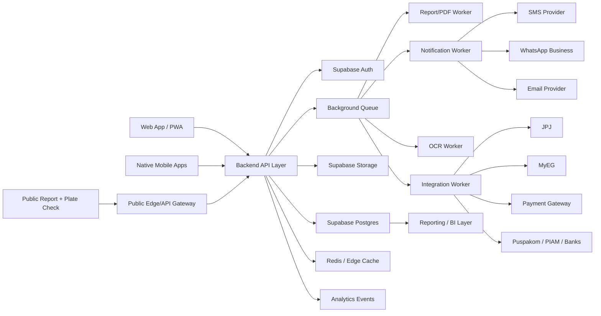

# SYSTEM_ARCHITECTURE.md
## Vehicle Passport Malaysia (VPM)

**Version:** 1.0  
**Role:** CTO review and target system architecture  
**Scope:** Product, data, security, scalability, and operational architecture  
**Code generation:** Not included

---

## 1. CTO Review Summary

The current project documents define a strong product vision and a good first-pass database model. The main gaps are not visual or conceptual; they are execution architecture gaps. VPM is a trust platform, so its architecture must handle consent, auditability, immutable evidence, third-party access, payment entitlements, async workloads, and partner integrations from day one.

The MVP can launch on Supabase/PostgreSQL with a web/PWA front end and a backend API layer, but the application should not expose raw Supabase table access directly for complex workflows. Business-critical flows such as vehicle claiming, workshop verification, report purchase, report generation, document sharing, subscription enforcement, and third-party access must go through service-layer APIs with validation, audit logging, and idempotency.

---

## 2. Critical Findings

### Missing Features

- Consent workflow for dealers, insurers, workshops, and shared report recipients.
- Vehicle claim verification flow beyond owner-entered plate/IC details.
- Vehicle ownership transfer approval and dispute workflow.
- Report revocation, report regeneration, and report expiry management.
- Payment checkout, payment confirmation, refund, credit pack, and subscription renewal flows.
- User invitation and staff onboarding flow for organizations.
- Workshop-to-owner service publication approval rules.
- Document sharing permissions and signed URL lifecycle.
- Notification template management.
- Admin moderation workflow for disputed records.
- Data export, account deactivation, anonymisation, and consent withdrawal.
- API key/OAuth app management for future partner APIs.
- Rate limits, abuse detection, and public lookup throttling.
- Support workflow for incorrect vehicle data, duplicate vehicles, and owner disputes.
- Backup/restore and incident response process.

### Missing Tables

- `vehicle_claims` for owner claims before creating current ownership.
- `vehicle_access_grants` for consent-based third-party access.
- `record_disputes` for disputes across service, repair, loan, insurance, and ownership records.
- `report_shares` for share link lifecycle separate from the report itself.
- `payments` and `payment_events` for checkout, webhook, and reconciliation.
- `credit_transactions` for report credits and usage audit.
- `subscription_events` for billing lifecycle history.
- `organization_invitations` for staff onboarding.
- `api_clients`, `api_keys`, and `oauth_tokens` for partner access.
- `webhook_events` for inbound payment/integration idempotency.
- `notification_templates` for SMS, WhatsApp, and email content.
- `notification_preferences` normalized by reminder type and channel.
- `document_access_grants` for per-party file sharing.
- `report_generation_jobs` for async report/PDF generation.
- `background_jobs` or queue metadata if not using an external queue.
- `admin_actions` or richer `audit_log` categorization for moderation.
- `data_subject_requests` for PDPA export/deletion workflows.

### Missing APIs

- Vehicle claim and verification APIs.
- Ownership transfer APIs.
- Consent grant/revoke APIs.
- Report purchase, credit usage, and report generation APIs.
- Shared report validation APIs.
- Payment checkout and webhook APIs.
- Organization invitation and member management APIs.
- Workshop job-to-service-publication APIs.
- Document upload signing and access grant APIs.
- Notification preference and template APIs.
- Admin dispute/moderation APIs.
- Partner API authentication and rate-limit APIs.
- Public plate teaser API with anti-abuse controls.

### Missing Business Logic

- How completeness score is calculated.
- How data confidence score is calculated.
- How service regularity is rated.
- How report flags are derived.
- How verified vs owner-declared records affect report trust.
- Who can create, verify, dispute, revoke, or supersede records.
- How road tax, insurance, and service reminders are scheduled.
- How a workshop-verified record becomes immutable.
- How report credits are consumed and refunded.
- How pay-per-report grants access without leaking raw PII.
- How organization plans enforce limits.
- How public reports mask VIN, IC, policy numbers, loan account numbers, and owner identity.
- How duplicate plate/VIN records are resolved.
- How previous owners lose access after transfer while preserving history.

### Security Issues

- Public report RLS policy currently allows token-based reads but does not model token entropy, revocation, recipient scope, or rate limits.
- RLS helper functions use `security definer`; they must have locked-down ownership, controlled grants, and fixed search paths.
- Admin role stored directly on `profiles` is convenient but risky without admin assignment workflow and audit.
- Documents need separate storage RLS policies; table RLS alone is not sufficient.
- IC encryption is noted but not fully specified: key custody, rotation, and decrypt permission boundaries are missing.
- Public plate lookup can leak vehicle existence, status, and flags if not rate-limited and minimized.
- Dealer and insurer access must be snapshot/consent-based, not raw table access.
- Payment webhooks need idempotency, signature verification, and replay protection.
- Workshop access to vehicle history must be limited unless owner consent exists.
- Audit logging should include IP, user agent, actor, organization, action category, and before/after hashes for sensitive actions.

### Scalability Issues

- Report generation under 5 seconds will be difficult if it synchronously computes all sections and renders PDF under load.
- Reminder sending, OCR, integration polling, and PDF rendering require async queues.
- Timeline queries will become heavy without materialized summaries.
- Public report and dealer lookup endpoints need caching and rate limiting.
- Large document uploads need direct-to-storage upload rather than proxying through the backend.
- Analytics should not query OLTP tables directly at scale.
- PostgreSQL JSON snapshots are good for reports, but source-of-truth event history needs queryable normalized tables.
- Multi-sided SaaS requires tenant isolation patterns and plan-limit enforcement before growth.

---

## 3. Target Architecture

### Architectural Position

- Supabase is the auth, database, storage, and RLS foundation.
- A backend API layer owns business workflows and prevents complex writes directly from clients.
- Background workers own long-running or retryable work.
- Public pages use snapshots and signed URLs, never raw vehicle records.
- Partner APIs are separated from user APIs and protected with OAuth/API keys, rate limits, and scoped grants.

---

## 4. Recommended Application Modules

### Identity & Access

- Supabase Auth
- `profiles`
- Organization membership
- Staff invitations
- RBAC and tenant-scoped permissions
- Admin role assignment workflow

### Vehicle Registry

- Vehicle identity
- Vehicle claims
- Ownership history
- Ownership transfer
- Duplicate record resolution
- Plate/VIN normalization

### Passport Records

- Service records
- Repair records
- Insurance records
- Road tax records
- Loan records
- EV records
- Record disputes
- Record verification status

### Document Vault

- Direct upload signing
- Metadata storage
- Record attachment
- Signed URL generation
- Document access grants
- OCR pipeline

### Workshop SaaS

- Workshop CRM
- Job cards
- Mechanics and assignments
- Inventory
- Invoices
- Service publication
- Campaigns
- Workshop analytics

### Reports & Dealer Access

- Report generation jobs
- Snapshot builder
- PDF renderer
- Report shares
- Dealer purchases
- Credit ledger
- Verified listing badges

### Notifications

- Reminder rules
- Scheduled reminders
- Message templates
- Channel preferences
- Delivery events
- Opt-out compliance

### Billing

- Plans
- Subscriptions
- Checkout sessions
- Payment events
- Credit packs
- Entitlement enforcement

### Integrations

- JPJ/MyEG validation
- Payment webhooks
- Messaging providers
- Puspakom/PIAM/banks in later versions
- Integration event logging
- Retry and dead-letter handling

### Admin & Compliance

- User management
- Organization verification
- Dispute moderation
- Data subject requests
- Audit log
- Consent management
- Integration health

---

## 5. Data Architecture Additions

### High-Priority MVP Additions

| Table | Why It Is Needed |
|---|---|
| `vehicle_claims` | Separates "user claims this vehicle" from verified/current ownership. |
| `vehicle_access_grants` | Required for consent-based access by workshops, dealers, insurers, and shared report viewers. |
| `record_disputes` | Enables non-destructive challenge and moderation flows. |
| `report_shares` | Separates report snapshot from share token lifecycle, revocation, and recipient audit. |
| `payments` | Stores checkout and payment state. |
| `payment_events` | Stores payment webhook events with idempotency. |
| `credit_transactions` | Makes report credits auditable and reversible. |
| `organization_invitations` | Supports workshop/dealer/insurer staff onboarding. |
| `notification_templates` | Prevents hardcoded message content. |
| `document_access_grants` | Controls time-limited file sharing. |
| `report_generation_jobs` | Allows async report/PDF generation and retries. |

### Version 2+ Additions

| Table | Why It Is Needed |
|---|---|
| `reminder_rules` | Configurable service reminder engine. |
| `campaigns` and `campaign_recipients` | Workshop reminder campaigns and analytics. |
| `inventory_movements` | Proper stock audit, not just current quantity. |
| `invoice_items` | Better invoice structure than job-card item reuse. |
| `dealer_batch_checks` | Bulk plate lookups and dealer quota enforcement. |
| `ocr_jobs` | Document intelligence pipeline. |

### Version 3+ Additions

| Table | Why It Is Needed |
|---|---|
| `api_clients` | Partner API registration. |
| `api_keys` | Scoped machine access. |
| `api_usage_events` | Metering and billing. |
| `webhook_subscriptions` | Partner webhook delivery. |
| `fleet_accounts` and `fleet_members` | Corporate fleet management. |
| `telematics_devices` and `telematics_events` | OBD2 and connected-vehicle data. |
| `data_subject_requests` | PDPA operations. |

---

## 6. Business Logic Architecture

### Vehicle Claiming

- User enters plate number and optional VIN/IC.
- System creates a `vehicle_claims` row.
- Claim status starts as `pending`.
- Verification can be manual, document-based, or integration-based.
- Ownership is created only after approval or a low-risk self-claim path.
- Duplicate claims enter admin review.

### Report Generation

- User requests a report.
- API checks entitlement: owner allowance, subscription, purchased report, or credit.
- API creates `report_generation_jobs`.
- Worker builds a normalized summary from source tables.
- Worker computes flags, confidence score, masks sensitive fields, creates `passport_reports.data_snapshot`, and renders PDF.
- Public access uses `report_shares`, not raw source records.

### Data Confidence Score

Recommended inputs:

- Percentage of verified workshop records.
- Presence of current insurance and road tax.
- Presence of ownership history.
- Recency of odometer readings.
- Number of independent data sources.
- Presence of disputes or revoked records.
- External integrations used.

### Completeness Score

Recommended inputs:

- Vehicle identity fields completed.
- Current owner verified.
- Service history present.
- Insurance record current.
- Road tax record current.
- Loan status known.
- Repair/accident section explicitly declared.
- Required documents uploaded.
- EV data present for BEV/PHEV.

### Record Immutability

- Verified records cannot be hard deleted by normal users.
- Incorrect records are disputed, superseded, revoked, or corrected by admin-approved amendment.
- Each sensitive transition writes to `audit_log`.

### Subscription Entitlements

- Plan limits are checked server-side.
- Credits are consumed through `credit_transactions`.
- Credit usage is idempotent and tied to report generation or purchase.
- Failed report generation should release or refund credits.

---

## 7. Security Architecture

### Core Controls

- RLS enabled on all application tables.
- Backend API validates workflow-level permissions beyond RLS.
- Service role key is never exposed to clients.
- Public endpoints use minimal, cached snapshots.
- All public tokens must be high entropy, revocable, expiring, and rate-limited.
- Storage access uses short-lived signed URLs.
- Sensitive identifiers are encrypted with managed keys and strict decrypt paths.
- Audit logs are append-only and protected from normal update/delete access.

### Access Rules

| Resource | Rule |
|---|---|
| Raw vehicle records | Current owner/co-owner/watcher, admin, or scoped service actor only. |
| Workshop job cards | Members of owning workshop organization only. |
| Dealer reports | Purchased snapshot only, not raw source records. |
| Insurer risk profiles | Consent or enterprise portfolio grant only. |
| Documents | Owner, originating organization, explicit access grant, or admin only. |
| Public report | Snapshot plus expiry, never raw documents or PII. |

### Public Lookup Safety

- Return only coarse teaser data.
- Do not expose owner identity, VIN, policy, loan, or exact document details.
- Apply IP/device/user rate limits.
- Detect scraping and bulk enumeration.
- Require authenticated dealer flow for higher-volume checks.

---

## 8. Scalability Architecture

### Async Workloads

Must be asynchronous:

- Report PDF rendering
- OCR processing
- Reminder sending
- Payment webhook reconciliation
- JPJ/MyEG/Puspakom/PIAM/bank polling
- Dealer batch checks
- Analytics rollups

### Caching

- Cache public report snapshots until expiry or revocation.
- Cache vehicle summary cards for dashboards.
- Cache pricing and plan metadata.
- Cache dealer teaser results with strict privacy constraints.

### Database Scaling

- Keep source-of-truth tables normalized.
- Use summary/materialized views for dashboards and reports.
- Partition high-volume event tables by time where needed: `notification_events`, `integration_events`, `audit_log`, `api_usage_events`, `telematics_events`.
- Add read replicas when report/dashboard load grows.
- Avoid querying `jsonb` snapshots for operational dashboards.

### Analytics

- Emit product events from the API layer.
- Keep OLTP PostgreSQL for transactional workflows.
- Use a separate BI/export layer for aggregate reporting at scale.

---

## 9. Recommended Technology Stack

| Layer | Recommendation |
|---|---|
| Frontend | React + TypeScript web/PWA |
| Backend API | Node.js/NestJS or Supabase Edge Functions for thin endpoints; prefer NestJS for complex workflows |
| Auth | Supabase Auth |
| Database | Supabase PostgreSQL |
| Storage | Supabase Storage |
| Queue | pg-boss, Supabase queues, Cloud Tasks, or a managed queue |
| Cache | Redis or edge cache |
| PDF rendering | Dedicated worker service |
| Notifications | SMS, WhatsApp Business, email provider |
| Payments | iPay88/Stripe with signed webhooks |
| Observability | Sentry, structured logs, uptime checks, metrics dashboards |

---

## 10. MVP Architecture Boundary

For MVP, build:

- Web/PWA client.
- Backend API for all workflow writes.
- Supabase Auth, Postgres, Storage.
- Queue-backed jobs for reports and notifications.
- Payment webhook handling.
- Admin verification and dispute workflow foundation.
- Public report snapshot access.

Do not build yet:

- Full Open API.
- Native apps.
- Real-time telematics.
- Complex AI/OCR automation.
- Multi-region deployment.

---

## 11. CTO Recommendations

1. Add consent and access grant models before implementing dealer or insurer access.
2. Add payment and credit ledgers before selling pay-per-report.
3. Treat Passport Reports as immutable snapshots with revocable share links.
4. Move report generation, reminders, OCR, and integrations to async workers.
5. Keep public lookup intentionally limited and rate-limited.
6. Build admin moderation early; trust products need human recovery paths.
7. Use RLS, but do not rely on RLS alone for complex business workflows.
8. Define score algorithms before UI implementation so dashboard and report values are consistent.
9. Create a clear API contract before frontend implementation.
10. Keep MVP narrow enough to launch, but architecture must already support auditability and consent.
---

## 12. P0 Alignment Status

The architecture document is the source of the P0 trust-platform direction. The following P0 decisions are now canonical across the project documents:

- MVP uses a backend API layer for workflow writes and does not rely on direct client writes for sensitive workflows.
- Vehicle claims, consent/access grants, disputes, async report jobs, report shares, payments, credit ledger, organization invitations, document grants, notification templates, and PDPA requests are required MVP foundations.
- Dealer and insurer modules remain later-phase product modules, but their access model must be designed from MVP through report snapshots and consent grants.
- Report generation, notifications, payment reconciliation, and integrations are asynchronous workloads.
- Public endpoints are minimized, rate-limited, and snapshot-based.

